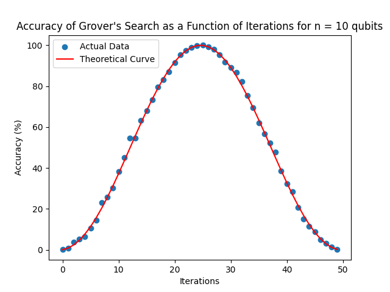
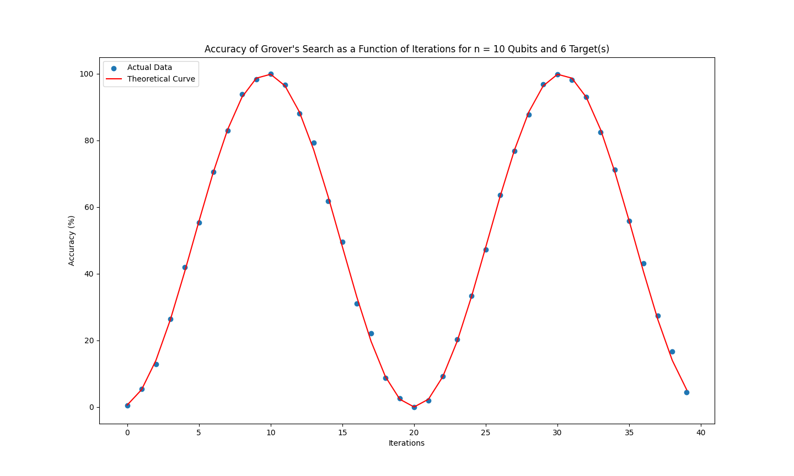
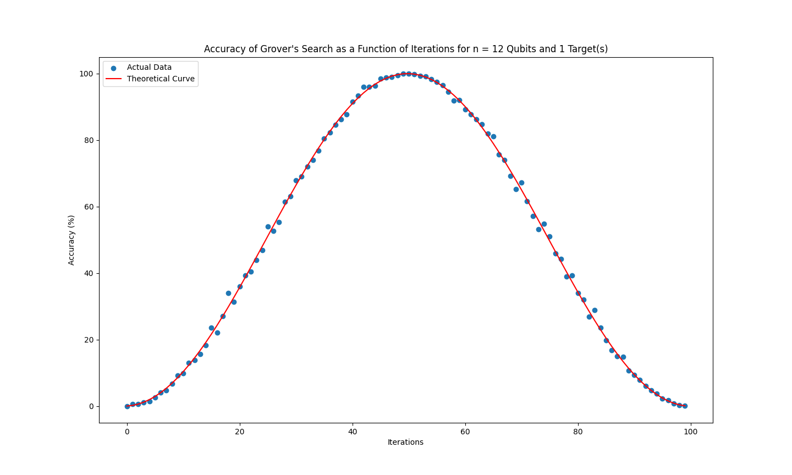

# Grover's Algorithm with Qiskit

## 📚 Summary: Grover's Search Algorithm

Grover's algorithm is a quantum search algorithm that provides a quadratic speedup for unstructured search problems. Given a search space of size N, and M marked "solutions", Grover’s algorithm finds a solution in roughly O(√N/M) iterations, compared to O(N/M) classically, offering a quadratic speedup.

The algorithm consists of the following key steps:

1. **Initialization**: Create an equal superposition of all N states.
2. **Grover Iteration**: Repeatedly apply:
   - The **oracle**, which flips the sign of the amplitude of the target states.
   - The **diffusion operator** (also called the Grover diffuser), which inverts the state amplitudes about the average.
3. **Measurement**: Measure the quantum state. With high probability, the result is one of the target solutions.

---

## 🧠 Oracle & Diffusion Operator

### 🔍 Oracle

The oracle is a quantum operation that marks the correct state(s) by flipping their phase. For a target state x, the oracle O acts to transform x into -x, and leave all other states unchanged.

In implementation, the oracle checks whether the current basis state matches any in the list of solution indices and applies a Z-gate (phase flip) if it does.

### 🔄 Diffusion Operator

The diffuser amplifies the amplitude of the marked states by reflecting the state vector about the average amplitude. This works because most of the states are positive resulting in a positive average amplitude. Upon reflection, the un-marked states decrease in amplitude (because they have a higher amplitude than the mean), while the marked states increase in amplitude (because they are negative, and thus lower than the mean).  In Qiskit, this is implemented as:

1. Apply Hadamard to all qubits
2. Apply X to all qubits
3. Apply a multi-controlled-Z gate
4. Apply X again
5. Apply Hadamard again

---

## 📊 Accuracy Graphs & Analysis

Below are plots showing the **probability of success** vs **number of Grover iterations** for various configurations.

The theoretical probability of success is dependent on the sine of the number of iterations squared. (Roughly)

### ✅ Example Plot (10 Qubits, 1 Target)

### ✅ Example Plot (10 Qubits, 6 Targets)

### ✅ Example Plot (12 Qubits, 1 Targets)

Note how the probability initially increases and peaks around the optimal number of iterations, then decreases in a sinusoidal fashion. Over-rotating (too many iterations) leads to a drop in success rate—this is intrinsic to the algorithm and is why knowing the number of solutions is important.

---

## 🔬 Noisy Simulation (coming soon...)

This implementation is currently **noiseless**. A future update will simulate realistic quantum noise using Qiskit’s `Aer` noise models, including:

- Bit-flip and phase-flip errors
- Depolarizing noise
- Readout errors

---

## 📁 Files

- `grover.py` — main implementation
- `oracle.py` — oracle builder
- `diffusion.py` — diffuser implementation
- `plotting.py` — plotting utilities
- `README.md` — this file

---
